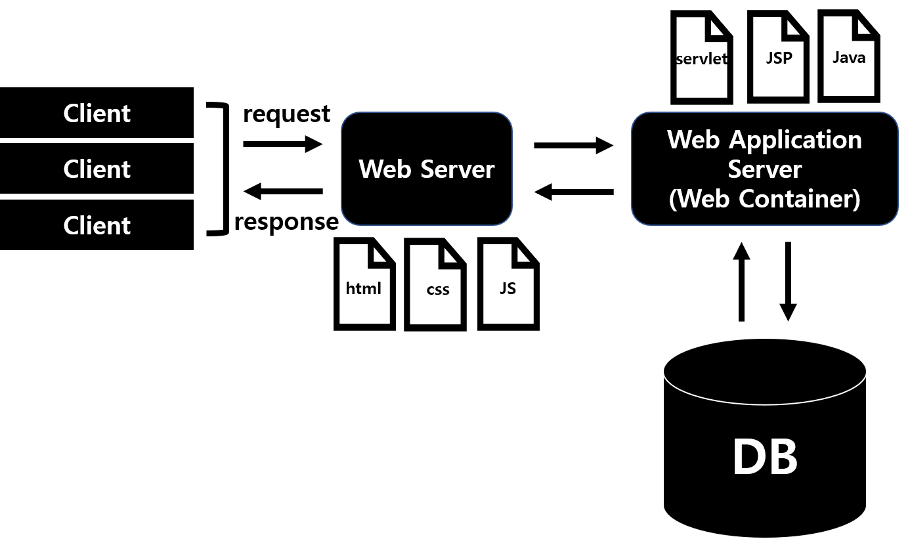

# Java-Web

##1. 동적 웹 프로그래밍
</img>
>클라이언트가 웹서버에 요청했을 때 정적파일의 경우 Web Server에서 요청한 파일을 찾아 클라이언트에게 응답을 함.
만약, 동적파일이 필요한 경우 웹서버는 이를 웹애플리케이션 서버(웹 컨테이너) 측에 위임하고 응답을 받아 다시 클라이언트에게 응답을 함.

##2. 웹 애플리케이션
>* 기본구조
